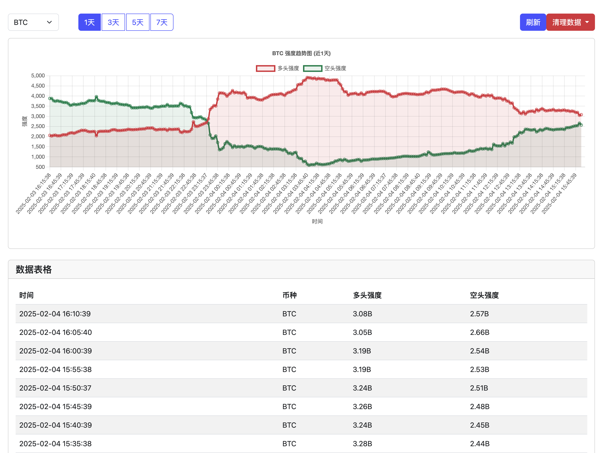

# Coinglass Data Scraper
本项目纯粹是爬虫技术的探讨, 不得用于商业目的。
在本项目中, 通过抓取 Coinglass 的某个chart页面的数据, 使用鼠标的悬停, 然后获取弹出框内的数据。
和以往的爬虫不同， 这个爬虫是基于浏览器的自动化技术实现的。通过代码可以学习到如何操作puppeteer， 然后
如何判断数据, 判断画面， 然后如何获取数据。
自动化抓取 Coinglass 平台的加密货币清算数据。

## 屏幕截图

## 系统要求

- Ubuntu 20.04 64-bit
- Node.js v16+ 
- npm 或 yarn

## Ubuntu 服务器部署步骤

1. 安装 Node.js 和 npm：
```bash
curl -fsSL https://deb.nodesource.com/setup_18.x | sudo -E bash -
sudo apt-get install -y nodejs
```

2. 安装必要的系统依赖：
```bash
# 安装 Chromium 和其依赖
sudo apt-get update
sudo apt-get install -y \
    chromium-browser 
    ca-certificates \
    fonts-liberation \
    libasound2 \
    libatk-bridge2.0-0 \
    libatk1.0-0 \
    libc6 \
    libcairo2 \
    libcups2 \
    libdbus-1-3 \
    libexpat1 \
    libfontconfig1 \
    libgbm1 \
    libgcc1 \
    libglib2.0-0 \
    libgtk-3-0 \
    libnspr4 \
    libnss3 \
    libpango-1.0-0 \
    libpangocairo-1.0-0 \
    libstdc++6 \
    libx11-6 \
    libx11-xcb1 \
    libxcb1 \
    libxcomposite1 \
    libxcursor1 \
    libxdamage1 \
    libxext6 \
    libxfixes3 \
    libxi6 \
    libxrandr2 \
    libxrender1 \
    libxss1 \
    libxtst6 \
    lsb-release \
    wget \
    xdg-utils
```

3. 克隆代码并安装依赖：
```bash
git clone https://github.com/cityisempty/coinglass.git
cd coinglass
npm install
```

4. 创建环境变量文件（可选）：
```bash
touch .env
# 编辑 .env 文件添加必要的环境变量
PORT=3000
APP_PASSWORD=your_secure_password    # 用于登录的密码
SESSION_SECRET=your_session_secret
DB_PATH=./liquidation.db
SCRAPE_INTERVAL=3600000
```

5. 运行测试：
```bash
node main.js
```

6. 设置定时任务（可选）：
```bash
# 编辑 crontab
crontab -e

# 添加定时任务，例如每小时运行一次
0 * * * * cd /path/to/coinglass && /usr/bin/node main.js >> /path/to/logfile.log 2>&1
```

## 故障排除

1. 如果遇到 Chromium 启动问题：
   - 检查是否正确安装了所有系统依赖
   - 确保 --no-sandbox 参数已添加
   - 检查系统日志中的错误信息

2. 如果遇到内存问题：
   - 调整 Node.js 内存限制：`NODE_OPTIONS=--max_old_space_size=4096 node main.js`
   - 检查系统可用内存

3. 如果遇到网络问题：
   - 确保服务器可以访问目标网站
   - 检查防火墙设置
   - 考虑使用代理服务器

## 注意事项

1. 无头模式（Headless Mode）：
   - 代码已配置为使用无头模式运行
   - 已添加必要的浏览器启动参数

2. 资源优化：
   - 已配置请求拦截，阻止不必要的资源加载
   - 设置了合理的超时时间

3. 错误处理：
   - 添加了基本的错误处理和重试机制
   - 建议配置日志记录系统

4. 目前只在 Ubuntu 20.04 64-bit 环境下测试，可能存在兼容性问题

5. 本项目仅用于学习和研究，不得用于商业目的

## 维护

- 定期检查日志文件
- 监控数据采集的完整性
- 及时更新依赖包
- 根据网站变化调整选择器
